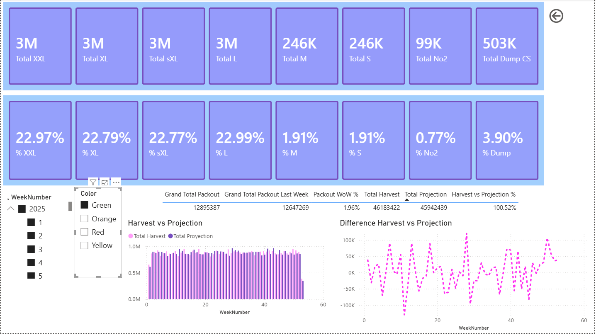
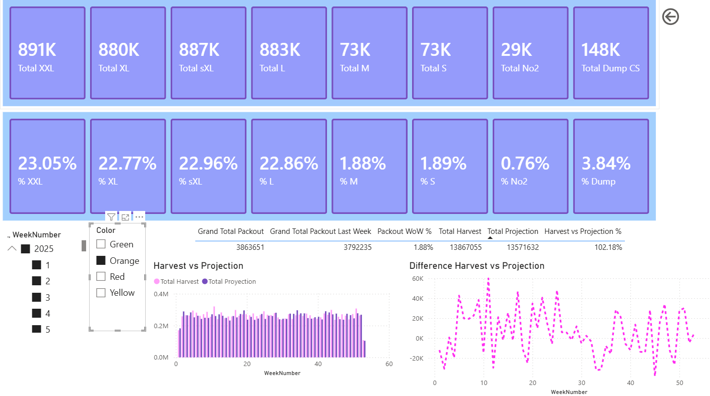
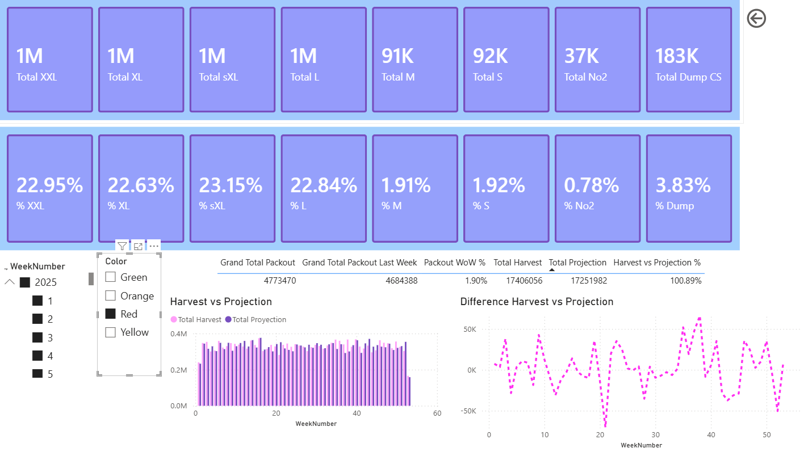

# 📊 Agricultural Packout Analytics Dashboard

An end-to-end Power BI reporting solution designed to track, analyze, and optimize agricultural harvesting operations, size distributions, waste rates, and week-over-week (WoW) performance against projections.

> ⚠️ **Disclaimer:** The dataset used in this project is mock/synthetic data generated strictly for demonstration, portfolio, and analytical modeling purposes. You can easily substitute the underlying data source with your own database schema and adapt the DAX measures to fit your specific operational business logic.

---

## 📌 Project Overview

In commercial greenhouse and agricultural packing operations, managing yield variances and monitoring size packout proportions is critical for supply chain optimization, sales forecasting, and quality control.

This project delivers a star-schema analytical model that consolidates production operational data into an interactive dashboard. It enables operational teams and farm managers to:

* **Track Yield Targets:** Monitor total harvest output against operational projections in real time.
* **Analyze Variance Trends:** Identify over/under-performing harvest weeks and evaluate production dips.
* **Optimize Grade Distributions:** Dynamically track size distributions (`% XXL`, `% XL`, `% sXL`, `% L`, `% M`, `% S`, `% No2`, `% Dump`) across crop colors and time periods.
* **Measure Weekly Growth:** Calculate week-over-week (WoW) throughput shifts to make data-driven supply chain decisions.

---

## 🏗️ Data Architecture & Modeling

The solution utilizes a clean **Star Schema** architecture in SQL and Power BI to ensure high query performance, referential integrity, and smooth time-intelligence aggregations.

```
       +-------------------+             +------------------+
       |   PeperID (Dim)   |             |  Calendar (Dim)  |
       +-------------------+             +------------------+
         |               |                 |              |
         | (1:N)         | (1:N)           | (1:N)        | (1:N)
         v               v                 v              v
+------------------+  +-------------------+  +------------------+  +------------------+
| Yearly_Harvest   |  | Yearly_Proyection |  | Yearly_Packout   |  | Yearly_Weights   |
|     (Fact)       |  |      (Fact)       |  |      (Fact)      |  |      (Fact)      |
+------------------+  +-------------------+  +------------------+  +------------------+

```

### Model Components & Relational Features

* **Dimension Tables (Lookups):**
* `Calendar`: Custom DAX date dimension using a continuous `WeekIndex` to prevent year-boundary errors during dynamic time-intelligence calculations.
* `PeperID`: Master dimension containing crop attributes (e.g., Green, Orange, Red, Yellow) and metadata.


* **Fact Tables (Data):**
* `Yearly_Packout`: Grade/size volume distributions (Dump, S, M, L, sXL, XL, XXL, No2).
* `Yearly_Harvest`: Raw harvested volumes collected across production areas.
* `Yearly_Proyection`: Operational Harvest expectations by week.
* `Yearly_Weights`: Daily average Fruits weight logs.


* **Referential Integrity:** SQL-defined foreign keys with `ON DELETE CASCADE` rules to maintain clean operational data synchronization.

---

## 🧮 Core DAX Logic & Calculations

The project relies on explicit measure branching to ensure metrics are performant, maintainable, and easily reusable across dynamic visuals.

### 1. Explicit Packout Aggregation

```dax
Grand Total Packout = 
[Total Dump CS] + [Total L] + [Total M] + 
[Total No2] + [Total S] + [Total sXL] + 
[Total XL] + [Total XXL]

```

### 2. Harvest vs. Projection Percentage

```dax
Harvest vs Projection % = 
DIVIDE(
    [Total Harvest], 
    [Total Proyection], 
    0
)

```

### 3. Week-over-Week (WoW) Packout Performance

```dax
Packout WoW % = 
VAR CurrentWeek = [Grand Total Packout]
VAR PreviousWeek = [Grand Total Packout Last Week]
RETURN
    DIVIDE(CurrentWeek - PreviousWeek, PreviousWeek, 0)

```

### 4. Size Category Percent Distribution Example

```dax
% XXL = 
DIVIDE(
    [Total XXL], 
    [Grand Total Packout], 
    0
)

```

---

## 📈 Dashboard Features & Visualization Layout

| Visual Section | Chart Type | Business Value |
| --- | --- | --- |
| **Volume KPI Cards** | Card Grid (Top Row) | Delivers instant visibility into absolute packout volume across all size classifications (XXL through Dump). |
| **Packout % Cards** | Card Grid (Middle Row) | Highlights quality distribution and size percentages dynamically filtered by harvest period. |
| **Operational Summary Table** | Matrix / Table | Consolidates WoW changes, actual harvests, projection targets, and yield achievement percentages into a unified operational view. |
| **Harvest vs. Target Comparison** | Clustered Column Chart | Side-by-side weekly comparative analysis contrasting actual harvest output (`Total Harvest`) against planned targets (`Total Projection`). |
| **Variance Line Chart** | Line Visual | Tracks weekly net volume divergence (Over/Under target baseline) to quickly isolate underperforming harvest weeks. |

---

## 🚀 How to Run & Replicate

1. **Database Schema Setup:** Run the included SQL schema scripts on your database engine to initialize dimension and fact tables with primary/foreign key constraints.
2. **Data Connection:** Connect Power BI Desktop to your database instance via DirectQuery or Import Mode.
3. **Explore Dashboard:** Open `Production_Yield_Tracking.pbix` in Power BI Desktop to interact with the slicers (`Year, WeekNumber`, `Color`), view DAX measures, and examine the star schema structure.

---

## 🛠️ Built With

* **Power BI Desktop** — Interactive report UI, custom formatting, and canvas layout design.
* **DAX (Data Analysis Expressions)** — Time intelligence, explicit measure branching, and dynamic percentage formulas.
* **SQL** — Relational star-schema design, data constraints, and table definitions.

---
## 📊 Interactive Dashboard Views

### Green Variety Selection


### Orange Variety Selection


### Red Variety Selection



